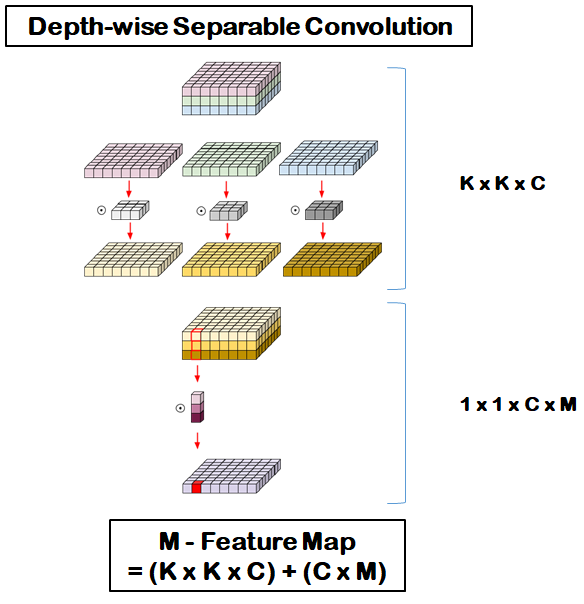
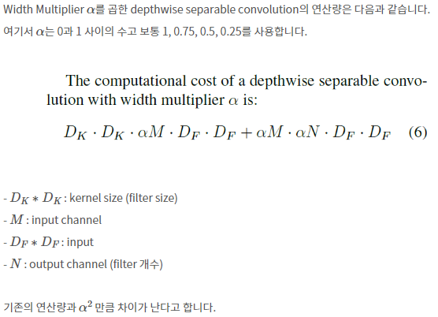
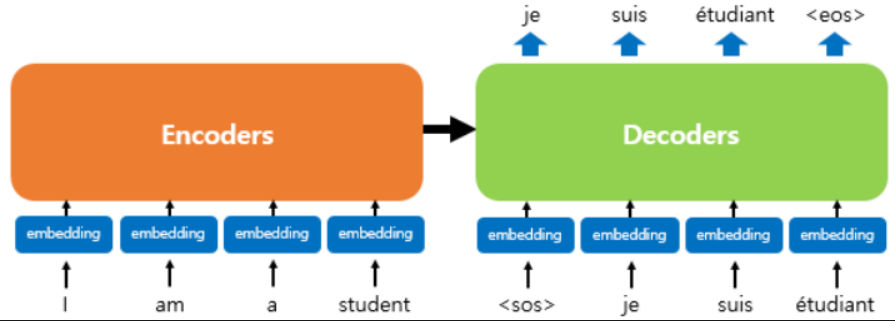
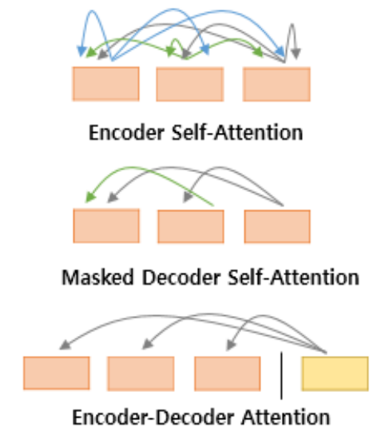

# CNN 모델 종류

## ResNet  
 - 이미지 분류에 있어 가장 기본적인 모델이다.
 - Feture Map Size는 2배로 줄고, 채널의 깊이는 2배로 증가(strides=2)
   > feture map과 channel의 깊이는 반비례 관계
 - 핵심 로직
   - Shortcut
   - Bottleneck block
 

## MobileNet  
 - 컴퓨터 성능이 제한되거나 배터리 퍼포먼스가 중요한 곳에서 사용될 목적으로 설계된 CNN구조이다.
 - 엣지 컴퓨팅
  - 클라우드에서 모든 연산을 처리하는 것이 아니라, 모바일 디바이스들이 직접 연산을 하거나 edge들에서 데이터 연산을 처리하여 클라우드에 데이터를 뿌려주는 것으로 mobilNet을 사용하려는 환경들이다.
 - 주요 기술?
   1. Channel Reduction
      - 채널 수를 줄인다. 
   2. Depthwise Separable Convolutions
      - 연산량은 input channel만큼 연산량이 줄어들게 된다.  
      
   3. Distillation & Compression
      - model의 dataset을 압축하는 방법.
 - 기존의 CNN과의 차이
   > 한 채널의 변화를 살펴보면 임의의 크기와 채널의 공간이 점 하나로 축소된다.  
   > Depthwise convolution은 채널 숫자는 줄어들지 않고 한 채널에서의 크기만 줄인다.
   
     
 

## EfficientNet  -> MobileNet의 기본을 받아서 사용
 - 적은 parameter 수로 더욱 좋은 성능을 내서 State-Of-The-Art를 달성한 model이다.
 - 주요 기술?
  1. Depthwise Separable Convolution
      - 모든 채널을 한 번에 convolution을 적용하는 것 대신에 이미지 혹은 feature map을 각 채널로 쪼개서 convolution을 적용하여, input의 feature을 일반 convolution보다 적은 양의 parameter로 분류할 수 있다. 
  2. Squeeze-and-excitation
     - 필터의 크기가 1로 고정되어 있는 여러 개의 채널을 하나의 새로운 채널로 합치는 역할
       > 채널의 수를 조절 (차원 감소 -> 연산량 감소)

 

## Transformer  
 - 2017년 구글이 발표한 논문인 Attention is all you need에서 나온 모델로 기존의 seq2seq의 구조인 encoder-decoder를 따르면서도 어텐션으로만 구현만 모델입니다.
 - RNN을 사용하지 않고, RNN보다 성능이 우수한 모델이다.
 - 기존 모델의 한계점인 encoding시 입력 시퀀스를 하나의 벡터로 압축하는 과정에서 입력 시퀀스 정보의 일부가 손실되는 단점을 보완하기 위해 어텐션을 활용한다.
 - 기존 모델과의 차이점은 encoder와 decoder의 단위가 N개 존재할 수 있다.
   > 기존 모델의 경우 encoder, decoder는 각각 한 개에 다른 시점을 가지는 구조  

	
 - 시작 심볼\<sos>에서 종료 심볼\<eos>이 나올 때까지 연산을 진행한다.
 

### 주요 파라미터
 1. $d_{model}=512$
    - encoder와 decoder에서 정해진 입력과 출력의 크기를 의미 
 2. `num_layers=value`
    - 트랜스포머 모델에서 encoder, decoder의 구성 층을 의미
 3. `num_heads=value`
    - 어텐션을 사용할 때 여러개로 분할해서 병렬로 어텐션을 수행하고 결과값을 하나로 합칠 때 병렬될 개수를 의미
 4. $d_{ff}=2048$
    - 트랜스포머 내부에는 피드 포워드 신경망이 존재하는 데 이때 은닉층의 크기를 의미  
 

### 포지셔널 인코딩(Positional Encoding)
 - 단어 입력을 순차적으로 받는 방식이 아니므로 단어의 위치 정보를 다른 방식으로 알려줄 필요가 있고, 이를 위해 각 단어의 임베딩 벡터에 위치 정보들을 더해 모델의 입력으로 사용하는데, 이를 포지셔널 인코딩이라한다.
 - 위치 정보를 가진 값을 만들기 위한 2가지 함수
    $$PE_{(pos,2i)}=\sin(\frac{pos}{10000^{\frac{2i}{d_{model}}}})$$
	$$PE_{(pos,2i+1)}=\cos(\frac{pos}{10000^{\frac{2i}{d_{model}}}})$$
   > pos : 임베딩 벡터 위치, i : 임베딩 벡터 내 차원의 index  
   > 임베딩 백터 내 차원이 짝수면 sin, 홀수면 cos함수를 이용  
   > $d_{model}$ : 트랜스포머의 모든층의 출력 차원을 의미  

 

### 어텐션
 - 사용되는 3가지 어텐션  
 
 - 가장 처음 self_attention만 encoder에서 처리하고 나머지는 decoder에서 처리한다.
   > self_attention : Query, Key, Value가 동일한 경우를 의미  
 - 마지막의 경우 Query는 decoder인 반면 Key, Value는 encoder이므로 self_attention이라고 하지 않는다.
 - Self_attention의 의미와 이점
   - 어텐션 함수는 주어진 Query에 대해 모든 Key와의 유사도를 각각 구합니다. 이후 해당 유사도를 가중치로 하여 Key와 매핑되어 있는 각각의 Value에 반영해줍니다. 마지막으로 유사도가 반영된 Value를 모두 가중합하여 반환한다.